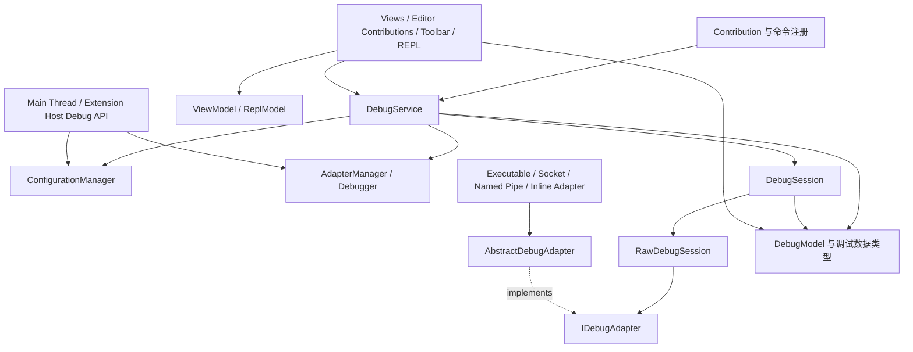

# VS Code Debug 功能源码导读

本文用于帮助读者理解 VS Code Debug 功能的源码组织方式，重点回答三个问题：

1. Debug 功能由哪些架构区域组成。
2. 核心类型分别承担什么职责。
3. 阅读某项能力时应从哪些源码文件开始。

本文聚焦架构边界、类型职责和源码阅读入口。

## 源码基准

- Repository：VS Code
- 本地目录：`/tmp/vscode`
- Commit：`925a0ffbf3e488061e4c01ae9d9ac88ae6907a7e`
- Version：`1.139.0`
- 主要源码根目录：`src/vs/workbench/contrib/debug`

文中的路径均相对于 VS Code repository root。

## 总体架构

VS Code Debug 功能以 `DebugService` 为工作台侧的协调中心。配置管理负责产生调试配置，adapter 管理负责连接扩展贡献的 debugger，session 层表示一次调试会话，protocol 与 transport 层负责 DAP 通信，domain model 保存断点、线程、调用栈和变量等调试数据，UI 层消费 service、session、model 与 view model 提供的状态。

这张图表示主要协作方向，不表示严格的单向依赖规则。VS Code 的 Debug 实现属于 workbench 功能，部分类型会直接使用 terminal、editor、task、storage、telemetry 和 extension-host 等平台服务。

## 目录导航

| 目录                                              | 主要内容                                                                           |
| ------------------------------------------------- | ---------------------------------------------------------------------------------- |
| `src/vs/workbench/contrib/debug/common`           | 公共接口、domain model、protocol 抽象、source、REPL、storage、telemetry 和共享工具 |
| `src/vs/workbench/contrib/debug/browser`          | 工作台侧服务、session、configuration、adapter 管理和主要 UI                        |
| `src/vs/workbench/contrib/debug/node`             | 基于 Node.js process、stream、TCP 和 named pipe 的 adapter transport               |
| `src/vs/workbench/contrib/debug/electron-browser` | Electron 环境中的 extension-host debug service                                     |
| `src/vs/workbench/contrib/debug/test`             | Debug service、model、session、adapter 和 UI 的测试                                |
| `src/vs/workbench/api/browser`                    | Debug API 的 main-thread bridge                                                    |
| `src/vs/workbench/api/common`                     | Extension Host 中的 Debug API 与 inline adapter 支持                               |
| `src/vs/workbench/api/node`                       | Node Extension Host 中与 terminal、process 相关的 Debug API 实现                   |

## 1. 功能注册与组合入口

这一部分把 Debug 功能注册到 workbench，包括服务、命令、菜单、视图、编辑器贡献和配置项。阅读整个功能如何装配时，应先从这里开始。

| 文件                                                                   | 职责                                                                                               |
| ---------------------------------------------------------------------- | -------------------------------------------------------------------------------------------------- |
| `src/vs/workbench/contrib/debug/browser/debug.contribution.ts`         | Debug 功能的主要 workbench contribution 入口，聚合视图、命令、菜单、编辑器贡献、配置和相关功能注册 |
| `src/vs/workbench/contrib/debug/browser/debug.service.contribution.ts` | 注册 `IDebugService` 和 `IDebugVisualizerService` singleton                                        |
| `src/vs/workbench/contrib/debug/browser/debugCommands.ts`              | 定义面向用户和 workbench 的 Debug 命令                                                             |
| `src/vs/workbench/contrib/debug/common/debugContext.ts`                | 定义 Debug 功能使用的 context keys                                                                 |
| `src/vs/workbench/contrib/debug/common/debug.ts`                       | 集中定义 Debug 子系统的公共接口、配置类型、状态类型和服务契约                                      |

## 2. 顶层编排与配置

### `DebugService`

- 源码：`src/vs/workbench/contrib/debug/browser/debugService.ts`
- 接口：`IDebugService`，位于 `src/vs/workbench/contrib/debug/common/debug.ts`
- 职责：作为 Debug 功能的工作台级协调服务，管理 session 集合、调试启动与停止、断点操作、焦点协调以及与 task、storage、telemetry、editor 和 UI 服务的协作。
- 主要协作者：`DebugModel`、`ViewModel`、`ConfigurationManager`、`AdapterManager`、`DebugSession`、`DebugTaskRunner`。

### `ConfigurationManager`

- 源码：`src/vs/workbench/contrib/debug/browser/debugConfigurationManager.ts`
- 接口：`IConfigurationManager`，位于 `src/vs/workbench/contrib/debug/common/debug.ts`
- 职责：管理 launch configuration、configuration provider、动态配置、配置选择和配置解析入口。
- 相关类型：`Launch`、`WorkspaceLaunch`、`UserLaunch`、`IDebugConfigurationProvider`、`IConfig`、`ICompound`。

### `AdapterManager`

- 源码：`src/vs/workbench/contrib/debug/browser/debugAdapterManager.ts`
- 接口：`IAdapterManager`，位于 `src/vs/workbench/contrib/debug/common/debug.ts`
- 职责：维护 debugger 注册信息和 adapter factory，协调 debugger extension 激活、adapter descriptor 获取、adapter 创建及 terminal launch 能力。
- 主要协作者：`Debugger`、`IDebugAdapterFactory`、`IDebugAdapterDescriptorFactory`、extension service。

### `Debugger`

- 源码：`src/vs/workbench/contrib/debug/common/debugger.ts`
- 接口：`IDebugger`、`IDebuggerMetadata`，位于 `src/vs/workbench/contrib/debug/common/debug.ts`
- 职责：表示一个已注册的 debugger 类型，封装 extension contribution 提供的元数据，并为 session 提供 adapter 创建、变量替换、终端启动和子 session 启动入口。

### `DebugTaskRunner`

- 源码：`src/vs/workbench/contrib/debug/browser/debugTaskRunner.ts`
- 职责：连接 Debug 生命周期与 VS Code Task 系统，负责调试配置关联任务的运行协调。

### `DebugCompoundRoot`

- 源码：`src/vs/workbench/contrib/debug/common/debugCompoundRoot.ts`
- 职责：表示 compound debug configuration 的共享生命周期边界，协调同一 compound 中多个 session 的关系。

## 3. Session 与 DAP facade

### `DebugSession`

- 源码：`src/vs/workbench/contrib/debug/browser/debugSession.ts`
- 接口：`IDebugSession`，位于 `src/vs/workbench/contrib/debug/common/debug.ts`
- 职责：表示一次 Debug session，是 workbench service、DAP client 和 domain model 之间的主要连接点。它负责 session 生命周期、线程与 source 的会话级归属、DAP event 到 model 的协调，以及面向上层的调试操作接口。
- 主要协作者：`DebugService`、`RawDebugSession`、`DebugModel`、`Thread`、`Source`、`ReplModel`。

### `RawDebugSession`

- 源码：`src/vs/workbench/contrib/debug/browser/rawDebugSession.ts`
- 职责：提供面向 `DebugSession` 的 DAP facade，统一承载 adapter 生命周期、DAP request、DAP event、adapter capability 和 reverse request。
- 主要协作者：`IDebugAdapter`、`IDebugger` 以及用于错误呈现和 extension-host 调试的 workbench services。

`DebugSession` 与 `RawDebugSession` 的边界是阅读源码时的重要切入点：前者关注 VS Code 的 session 与 model 语义，后者关注 DAP client 语义。

## 4. Protocol 与 Adapter 抽象

### `IDebugAdapter`

- 源码：`src/vs/workbench/contrib/debug/common/debug.ts`
- 职责：定义 VS Code 内部使用的 adapter 通信契约，隔离上层 DAP client 与具体 transport 或 extension-host bridge。

### `AbstractDebugAdapter`

- 源码：`src/vs/workbench/contrib/debug/common/abstractDebugAdapter.ts`
- 职责：提供与 transport 无关的 DAP message 基础设施，包括 request、response、event 和 reverse request 的公共协议层职责。
- 子类来源：Node transport、Extension Host bridge、inline adapter 和测试 adapter。

### DAP 类型定义

- 源码：`src/vs/workbench/contrib/debug/common/debugProtocol.d.ts`
- 职责：声明 VS Code Debug 实现使用的 DAP message、request、response、event 和 capability 类型。
- 阅读用途：确认协议字段和 capability 的权威类型定义；不应从 UI 或 model 类型反推协议定义。

## 5. Transport 与 Adapter 实例

Node 环境中的主要 transport 类型集中在 `src/vs/workbench/contrib/debug/node/debugAdapter.ts`。

| 类型                     | 职责                                                       |
| ------------------------ | ---------------------------------------------------------- |
| `StreamDebugAdapter`     | 为基于 Node stream 的 adapter 提供 DAP message framing     |
| `NetworkDebugAdapter`    | 提供 network connection 类型 adapter 的公共基类            |
| `SocketDebugAdapter`     | 连接 TCP debug adapter server                              |
| `NamedPipeDebugAdapter`  | 连接 named pipe 或 Unix domain socket debug adapter server |
| `ExecutableDebugAdapter` | 启动本地 adapter process，并通过其标准输入输出通信         |

对应的 descriptor 与 factory 接口位于 `src/vs/workbench/contrib/debug/common/debug.ts`：

- `IDebugAdapterExecutable`
- `IDebugAdapterServer`
- `IDebugAdapterNamedPipeServer`
- `IDebugAdapterInlineImpl`
- `IDebugAdapterFactory`
- `IDebugAdapterDescriptorFactory`

除 Node transport 外，还应关注以下 adapter bridge：

| 类型                               | 源码路径                                                 | 职责                                                               |
| ---------------------------------- | -------------------------------------------------------- | ------------------------------------------------------------------ |
| `ExtensionHostDebugAdapter`        | `src/vs/workbench/api/browser/mainThreadDebugService.ts` | 在 main thread 与 Extension Host 中的 adapter 之间桥接 DAP message |
| `DirectDebugAdapter`               | `src/vs/workbench/api/common/extHostDebugService.ts`     | 包装 extension 提供的 inline `DebugAdapter` implementation         |
| `DebugAdapterInlineImplementation` | `src/vs/workbench/api/common/extHostTypes.ts`            | VS Code extension API 对 inline adapter 的公开包装类型             |

## 6. Debug domain model

Debug domain model 的主要实现位于 `src/vs/workbench/contrib/debug/common/debugModel.ts`，公共接口位于 `src/vs/workbench/contrib/debug/common/debug.ts`。

### 根模型

| 类型         | 职责                                                                                            |
| ------------ | ----------------------------------------------------------------------------------------------- |
| `DebugModel` | 保存 Debug 功能的 session、breakpoint 和 watch expression 等共享数据，并向消费者发布 model 变化 |

### 执行状态模型

| 类型         | 职责                                                            |
| ------------ | --------------------------------------------------------------- |
| `Thread`     | 表示一个 debuggee thread，并承载该线程的停止信息与 call stack   |
| `StackFrame` | 表示 call stack 中的一个 frame，并关联 source location 与 scope |
| `Scope`      | 表示 frame 内的一组变量作用域                                   |
| `ErrorScope` | 表示 scope 获取失败时供上层展示的错误节点                       |

### 表达式与变量模型

| 类型                   | 职责                                            |
| ---------------------- | ----------------------------------------------- |
| `ExpressionContainer`  | 变量、scope 和表达式结果的公共容器抽象          |
| `Variable`             | 表示 adapter 返回的变量节点                     |
| `Expression`           | 表示 watch、REPL 或其他上下文中的待求值表达式   |
| `VisualizedExpression` | 表示通过 debug visualization 扩展转换后的表达式 |

### Breakpoint 模型

| 类型                    | 职责                                              |
| ----------------------- | ------------------------------------------------- |
| `Enablement`            | 提供可启用对象的基础表示                          |
| `BaseBreakpoint`        | 定义各类 breakpoint 共享的数据与 session 关联信息 |
| `Breakpoint`            | 表示 source breakpoint                            |
| `FunctionBreakpoint`    | 表示 function breakpoint                          |
| `DataBreakpoint`        | 表示 data breakpoint                              |
| `ExceptionBreakpoint`   | 表示 exception breakpoint filter                  |
| `InstructionBreakpoint` | 表示 instruction breakpoint                       |

### Source 与 memory

| 类型                            | 源码路径                                                        | 职责                                                             |
| ------------------------------- | --------------------------------------------------------------- | ---------------------------------------------------------------- |
| `Source`                        | `src/vs/workbench/contrib/debug/common/debugSource.ts`          | 表示 DAP source 及其对应的 VS Code URI                           |
| `MemoryRegion`                  | `src/vs/workbench/contrib/debug/common/debugModel.ts`           | 表示 debuggee memory 的可访问区域                                |
| `DebugMemoryFileSystemProvider` | `src/vs/workbench/contrib/debug/browser/debugMemory.ts`         | 将 debuggee memory 暴露给 VS Code file system 与 editor 基础设施 |
| `DisassemblyViewInput`          | `src/vs/workbench/contrib/debug/common/disassemblyViewInput.ts` | 表示 disassembly editor input                                    |

## 7. View state 与 REPL model

### `ViewModel`

- 源码：`src/vs/workbench/contrib/debug/common/debugViewModel.ts`
- 接口：`IViewModel`，位于 `src/vs/workbench/contrib/debug/common/debug.ts`
- 职责：保存当前 UI 聚焦的 session、thread 和 stack frame，以及 Debug views 共享的展示状态。
- 边界：`DebugModel` 表示调试数据，`ViewModel` 表示用户当前查看的数据。

### `ReplModel` 及其节点类型

- 源码：`src/vs/workbench/contrib/debug/common/replModel.ts`
- 职责：保存 Debug Console 的输出、表达式求值结果和分组结构。

主要类型：

| 类型                   | 职责                       |
| ---------------------- | -------------------------- |
| `ReplModel`            | Debug Console 的根 model   |
| `ReplOutputElement`    | 普通输出节点               |
| `ReplVariableElement`  | 与变量关联的输出节点       |
| `RawObjectReplElement` | 表示结构化原始对象         |
| `ReplEvaluationInput`  | 表示一次 REPL 输入         |
| `ReplEvaluationResult` | 表示一次 REPL 求值结果     |
| `ReplGroup`            | 表示一组可嵌套的 REPL 输出 |

## 8. Extension API bridge

VS Code extension 可以贡献 debugger、configuration provider、adapter descriptor factory、tracker 和 inline adapter。相关 API 在 main thread 与 Extension Host 之间分层实现。

| 文件                                                     | 职责                                                                                                 |
| -------------------------------------------------------- | ---------------------------------------------------------------------------------------------------- |
| `src/vs/workbench/api/browser/mainThreadDebugService.ts` | 接收 Extension Host 的 Debug API 调用，并连接 workbench Debug services                               |
| `src/vs/workbench/api/common/extHostDebugService.ts`     | 实现 extension-facing Debug API，管理 extension 注册的 provider、factory、tracker 和 session wrapper |
| `src/vs/workbench/api/node/extHostDebugService.ts`       | 提供依赖 Node process 与 terminal 能力的 Extension Host 实现                                         |

阅读 extension 与 Debug core 的边界时，可以同时对照公开 API 声明：

- `src/vscode-dts/vscode.d.ts`
- `src/vs/workbench/api/common/extHostTypes.ts`

### Extension Development Host 调试设施

以下文件服务于 Extension Development Host 的启动与调试，不属于普通 debugger extension 注册 bridge：

| 文件                                                                           | 职责                                                            |
| ------------------------------------------------------------------------------ | --------------------------------------------------------------- |
| `src/vs/workbench/contrib/debug/browser/extensionHostDebugService.ts`          | 定义 browser workbench 中的 Extension Development Host 调试能力 |
| `src/vs/workbench/contrib/debug/electron-browser/extensionHostDebugService.ts` | 提供 Electron workbench 对应实现                                |
| `src/vs/platform/debug/common/extensionHostDebug.ts`                           | 定义跨层使用的 Extension Development Host 调试契约              |

## 9. UI 与编辑器集成

UI 文件主要位于 `src/vs/workbench/contrib/debug/browser`。它们消费 `DebugService`、`DebugModel`、`ViewModel` 和 `ReplModel`，并把用户操作转发给相应服务或 session。

### 主要视图

| 主要类型                  | 源码路径                                                          | 职责                         |
| ------------------------- | ----------------------------------------------------------------- | ---------------------------- |
| `CallStackView`           | `src/vs/workbench/contrib/debug/browser/callStackView.ts`         | Call Stack view              |
| `VariablesView`           | `src/vs/workbench/contrib/debug/browser/variablesView.ts`         | Variables view               |
| `WatchExpressionsView`    | `src/vs/workbench/contrib/debug/browser/watchExpressionsView.ts`  | Watch view                   |
| `BreakpointsView`         | `src/vs/workbench/contrib/debug/browser/breakpointsView.ts`       | Breakpoints view             |
| `LoadedScriptsView`       | `src/vs/workbench/contrib/debug/browser/loadedScriptsView.ts`     | Loaded Scripts view          |
| `Repl` 及相关 viewer 类型 | `src/vs/workbench/contrib/debug/browser/repl.ts`、`replViewer.ts` | Debug Console 与其树形展示   |
| `DisassemblyView`         | `src/vs/workbench/contrib/debug/browser/disassemblyView.ts`       | Disassembly view             |
| `DebugViewPaneContainer`  | `src/vs/workbench/contrib/debug/browser/debugViewlet.ts`          | Run and Debug view container |

### 编辑器交互

| 主要类型                       | 源码路径                                                                 | 职责                                |
| ------------------------------ | ------------------------------------------------------------------------ | ----------------------------------- |
| `DebugEditorContribution`      | `src/vs/workbench/contrib/debug/browser/debugEditorContribution.ts`      | Debug 状态与 code editor 的主要集成 |
| `BreakpointEditorContribution` | `src/vs/workbench/contrib/debug/browser/breakpointEditorContribution.ts` | 编辑器中的 breakpoint 交互          |
| `CallStackEditorContribution`  | `src/vs/workbench/contrib/debug/browser/callStackEditorContribution.ts`  | 当前 stack frame 与编辑器位置的关联 |
| `DebugHoverWidget`             | `src/vs/workbench/contrib/debug/browser/debugHover.ts`                   | Debug hover                         |
| `BreakpointWidget`             | `src/vs/workbench/contrib/debug/browser/breakpointWidget.ts`             | Breakpoint 编辑控件                 |
| `ExceptionWidget`              | `src/vs/workbench/contrib/debug/browser/exceptionWidget.ts`              | Exception 信息控件                  |

### 操作与状态展示

| 主要类型或模块                  | 源码路径                                                       | 职责                             |
| ------------------------------- | -------------------------------------------------------------- | -------------------------------- |
| `DebugToolBar`                  | `src/vs/workbench/contrib/debug/browser/debugToolBar.ts`       | Debug toolbar                    |
| `DebugStatusContribution`       | `src/vs/workbench/contrib/debug/browser/debugStatus.ts`        | Debug 状态展示                   |
| `DebugTitleContribution`        | `src/vs/workbench/contrib/debug/browser/debugTitle.ts`         | Debug 视图标题操作               |
| `DebugProgressContribution`     | `src/vs/workbench/contrib/debug/browser/debugProgress.ts`      | Debug progress 的 workbench 展示 |
| `StartDebugQuickAccessProvider` | `src/vs/workbench/contrib/debug/browser/debugQuickAccess.ts`   | Debug 相关 quick access          |
| Session picker 模块             | `src/vs/workbench/contrib/debug/browser/debugSessionPicker.ts` | Session 选择 UI                  |

## 10. Storage、telemetry 与辅助模块

| 文件                                                            | 主要职责                                                |
| --------------------------------------------------------------- | ------------------------------------------------------- |
| `src/vs/workbench/contrib/debug/common/debugStorage.ts`         | 保存和恢复 breakpoint、watch expression 等持久化数据    |
| `src/vs/workbench/contrib/debug/common/debugTelemetry.ts`       | Debug session telemetry                                 |
| `src/vs/workbench/contrib/debug/common/debugLifecycle.ts`       | 在存在活动 Debug session 时参与 workbench shutdown 确认 |
| `src/vs/workbench/contrib/debug/common/debugSchemas.ts`         | Debug configuration schema                              |
| `src/vs/workbench/contrib/debug/common/debugUtils.ts`           | Debug 子系统共享工具                                    |
| `src/vs/workbench/contrib/debug/common/breakpoints.ts`          | 表示语言贡献的 breakpoint 支持条件                      |
| `src/vs/workbench/contrib/debug/common/debugVisualizers.ts`     | 定义 Debug visualization 模型及其注册服务               |
| `src/vs/workbench/contrib/debug/common/debugContentProvider.ts` | Adapter source 内容与 text model 的连接                 |
| `src/vs/workbench/contrib/debug/common/nullDebugService.ts`     | 不具备完整 Debug 环境时使用的空实现                     |

## 推荐阅读路线

### 理解一次 Debug session 的核心对象

1. `src/vs/workbench/contrib/debug/common/debug.ts`
2. `src/vs/workbench/contrib/debug/browser/debugService.ts`
3. `src/vs/workbench/contrib/debug/browser/debugSession.ts`
4. `src/vs/workbench/contrib/debug/browser/rawDebugSession.ts`
5. `src/vs/workbench/contrib/debug/common/debugModel.ts`

### 理解 DAP client 与 transport 边界

1. `src/vs/workbench/contrib/debug/common/debugProtocol.d.ts`
2. `src/vs/workbench/contrib/debug/common/debug.ts` 中的 `IDebugAdapter`
3. `src/vs/workbench/contrib/debug/common/abstractDebugAdapter.ts`
4. `src/vs/workbench/contrib/debug/node/debugAdapter.ts`
5. `src/vs/workbench/contrib/debug/browser/rawDebugSession.ts`

### 理解 debugger extension 如何接入

1. `src/vs/workbench/contrib/debug/browser/debugAdapterManager.ts`
2. `src/vs/workbench/contrib/debug/common/debugger.ts`
3. `src/vs/workbench/api/browser/mainThreadDebugService.ts`
4. `src/vs/workbench/api/common/extHostDebugService.ts`
5. `src/vs/workbench/api/node/extHostDebugService.ts`

### 理解 Debug UI 如何消费状态

1. `src/vs/workbench/contrib/debug/common/debugModel.ts`
2. `src/vs/workbench/contrib/debug/common/debugViewModel.ts`
3. `src/vs/workbench/contrib/debug/common/replModel.ts`
4. `src/vs/workbench/contrib/debug/browser/callStackView.ts`
5. `src/vs/workbench/contrib/debug/browser/variablesView.ts`
6. `src/vs/workbench/contrib/debug/browser/repl.ts`

## 核心类型索引

| 架构区域         | 核心类型                                                                                                             | 源码文件                                                                     |
| ---------------- | -------------------------------------------------------------------------------------------------------------------- | ---------------------------------------------------------------------------- |
| 顶层编排         | `DebugService`                                                                                                       | `browser/debugService.ts`                                                    |
| 配置             | `ConfigurationManager`、`Launch`                                                                                     | `browser/debugConfigurationManager.ts`                                       |
| Debugger 注册    | `AdapterManager`                                                                                                     | `browser/debugAdapterManager.ts`                                             |
| Debugger 元数据  | `Debugger`                                                                                                           | `common/debugger.ts`                                                         |
| Session          | `DebugSession`                                                                                                       | `browser/debugSession.ts`                                                    |
| DAP facade       | `RawDebugSession`                                                                                                    | `browser/rawDebugSession.ts`                                                 |
| Protocol engine  | `AbstractDebugAdapter`                                                                                               | `common/abstractDebugAdapter.ts`                                             |
| Adapter contract | `IDebugAdapter` 及 descriptor interfaces                                                                             | `common/debug.ts`                                                            |
| Node transport   | `StreamDebugAdapter`、`NetworkDebugAdapter`、`SocketDebugAdapter`、`NamedPipeDebugAdapter`、`ExecutableDebugAdapter` | `node/debugAdapter.ts`                                                       |
| Root model       | `DebugModel`                                                                                                         | `common/debugModel.ts`                                                       |
| Execution model  | `Thread`、`StackFrame`、`Scope`                                                                                      | `common/debugModel.ts`                                                       |
| Value model      | `ExpressionContainer`、`Variable`、`Expression`                                                                      | `common/debugModel.ts`                                                       |
| Breakpoint model | `BaseBreakpoint` 及各 concrete breakpoint 类型                                                                       | `common/debugModel.ts`                                                       |
| Source           | `Source`                                                                                                             | `common/debugSource.ts`                                                      |
| View state       | `ViewModel`                                                                                                          | `common/debugViewModel.ts`                                                   |
| Debug Console    | `ReplModel` 及 REPL element 类型                                                                                     | `common/replModel.ts`                                                        |
| Extension bridge | `MainThreadDebugService`、`ExtHostDebugServiceBase`                                                                  | `api/browser/mainThreadDebugService.ts`、`api/common/extHostDebugService.ts` |

这份索引用于首次定位；进入具体功能后，应沿接口实现、构造函数依赖和引用关系确认组件边界。
